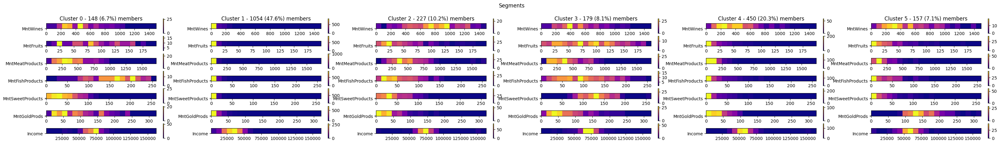

# random ml projects
### 1. market segmentation
> clustering

___
- [dataset](https://www.kaggle.com/code/karnikakapoor/customer-segmentation-clustering/input)

### 2. disease classification
> decision trees, neural networks

(download this image to see the text)

___
- [dataset](https://www.kaggle.com/datasets/kaushil268/disease-prediction-using-machine-learning)

### 3. diabetes (binary) classification
> neural networks, logistic regression, regularization

___
- [dataset](https://www.kaggle.com/datasets/mathchi/diabetes-data-set?resource=download)

### 4. academic performance predictor
> neural networks, linear regression

___
- [dataset](https://archive.ics.uci.edu/dataset/320/student+performance)

### 5. fraud detection
> anomaly detection, PCA (dataset)

___
- [dataset](https://www.kaggle.com/datasets/mlg-ulb/creditcardfraud)

# docs
jupyter notebook commands:
- `%pip freeze >> ../requirements.txt`
- `%pip install -r ../requirements.txt`